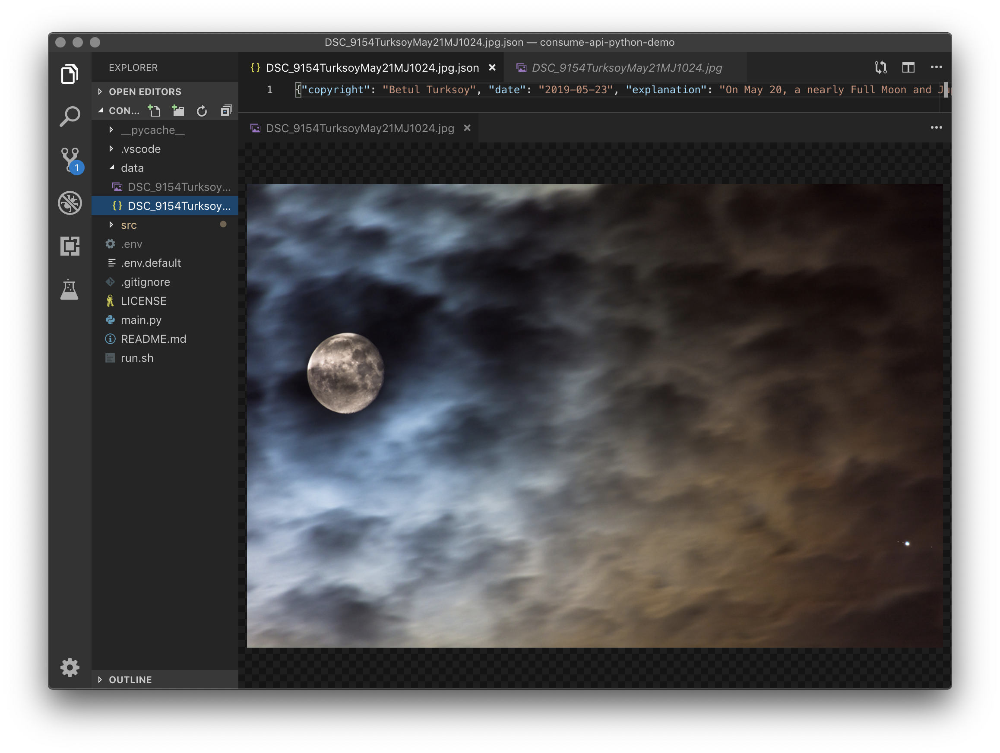

# consume-api-python-demo
This example project is a companion to [this article](https://itnext.io/consuming-web-apis-with-python-fa9b751d2c75) about how to consume open web APIs with Python

## Introduction
This project contains a simple Python3 example for working with an open API (in this case the [NASA API](https://api.nasa.gov/api.html#apod).
In this example, the _Astronomy Picture of the Day_ is retrieved and a copy of it, along with a .json info file, is saved to the `data/` folder.

## Getting Started
To run this example:
* If you don't already have Python3, grab it [over here](https://www.python.org/downloads/)
* Clone this repo
* Run the example with `./run.sh` or by executing `python3 main.py`
* Check contents of `data/` for today's featured astronomy photo from NASA

## Contribution
If you notice something out of place or in need of some improvements: issues, pull requests, and other contributions are welcome.

Thanks for checking out this project!
[@8_bit_hacker](https://twitter.com/8_bit_hacker)
